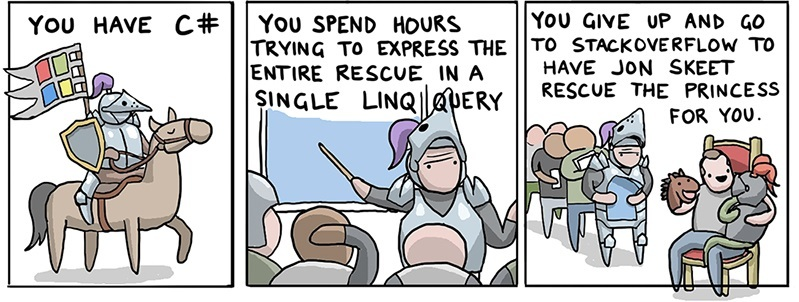
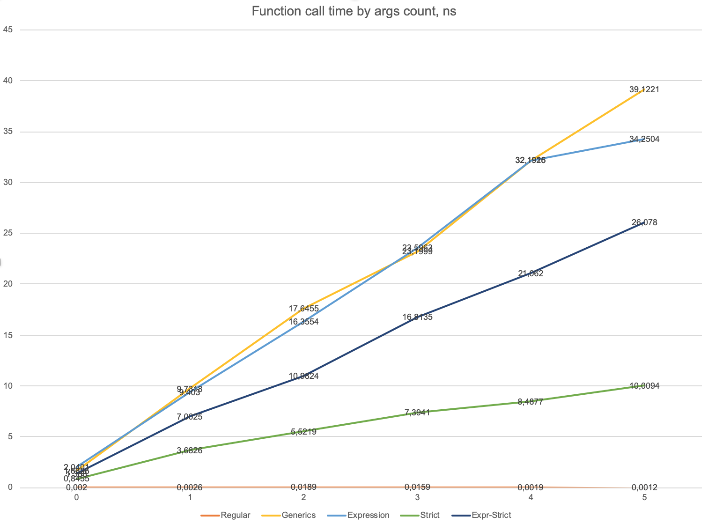

# Метод барона Мюнхгаузена, или как быстро вызвать функцию, о которой (почти) ничего не знаешь

Эта история началась очень издалека. В один прекрасный день я приобрёл себе Lego Mindstorms, очень скоро разочаровался в его среде разработки и задался целью написать для него фреймворк для разработки на C#. Вдохновившись моделью контроллера ASP.NET, я начал сооружать нечто подобное: логика робота описывается одним классом, свойства (properties) которого - это показания сенсоров, а методы - шаги одной итерации event loop'а робота, получающие в качестве аргументов значения свойств. Естественно, для этого нужно научиться вызывать методы произвольной сигнатуры в рантайме, а с учётом того, что работает это всё на дохленьком ARM9 - это нужно делать *быстро*. К каким изысканиям это привело - читайте в этой статье.

Поскольку заявленная тема касается только вызова функций, я опущу все подробности того, как роботогенератор находит нужные в какой-то момент времени функции и их аргументы, и сосредоточусь только на том, как эти функции, собственно, вызвать. Ещё одно упрощение - нас будут интересовать только методы без возвращаемого значения (void). Никаких принципиальных отличий с другими методами не будет.

## Первое приближение

Первое, что приходит в голову в таких задачах - воспользоваться рефлексией:

```C#
var method = model.GetType().GetMethod(methodName,
                                       BindingFlags.Public | BindingFlags.Instance);
method.Invoke(target, new [] { arg1, arg2 /*, ... */ };
```

Ищем среди публичных методов нужный нам `MethodInfo`, складываем необходимые ему аргументы (нам даже не нужно знать их тип) в массив объектов и вызываем. Коротко и понятно. Но, как мы все знаем, работа с reflection - дело дорогое. А вот насколько дорогое? Чтобы не быть голословными, сделаем небольшой бенчмарк с помощью библиотеки [BenchmarkDotNet](https://benchmarkdotnet.org/):

```C#
public class FunctionCallBenchmark
{
    private int Arg1 => 1;
    private char Arg2 => '2';
    private double Arg3 => 3.0;
    private bool Arg4 => true;
    private string Arg5 => "5";
    private decimal Arg6 => 6.0m;

    public void ZeroArgMethod() { }
    public void OneArgMethod(int arg1) { }
    public void TwoArgMethod(int arg1, char arg2) { }
    public void ThreeArgMethod(int arg1, char arg2, double arg3) { }
    public void FourArgMethod(int arg1, char arg2, double arg3, bool arg4) { }
    public void FiveArgMethod(int arg1, char arg2, double arg3, bool arg4, string arg5) { }
    public void SixArgMethod(int arg1, char arg2, double arg3, bool arg4, string arg5, decimal arg6) { }

    // Reflection-based:
    private Action _reflectionBasedZeroArgAction;
    /* ... */
    private Action _reflectionBasedSixArgAction;

    public FunctionCallBenchmark()
    {
        var objectGetters =
                new Func<object>[] { () => Arg1, () => Arg2, () => Arg3, () => Arg4, () => Arg5, () => Arg6 };

        _reflectionBasedZeroArgAction = GenerateReflectionBasedAction(nameof(ZeroArgMethod), objectGetters.Take(0));
        /* ... */
        _reflectionBasedFiveArgAction = GenerateReflectionBasedAction(nameof(FiveArgMethod), objectGetters.Take(5));
        _reflectionBasedSixArgAction = GenerateReflectionBasedAction(nameof(SixArgMethod), objectGetters);
    }

    private Action GenerateReflectionBasedAction(string methodName, IEnumerable<Func<object>> parameters)
    {
        var method = this.GetType().GetMethod(methodName,
                                              BindingFlags.Public | BindingFlags.Instance);
        if (method == null)
            throw new ArgumentNullException(methodName);
        return () => method.Invoke(this, parameters.Select(p => p()).ToArray());
    }

    // Regular calls:
    [Benchmark]
    public void RegularZeroArgCall() => ZeroArgMethod();

    /* ... */

    [Benchmark]
    public void RegularSixArgCall() => SixArgMethod(Arg1, Arg2, Arg3, Arg4, Arg5, Arg6);

    // Reflection-based calls:
    [Benchmark]
    public void ReflectionBasedZeroArgAction() => _reflectionBasedZeroArgAction();

    /* ... */

    [Benchmark]
    public void ReflectionBasedSixArgAction() => _reflectionBasedSixArgAction();
}
```

Сравнивать будем обычные вызовы функций с количеством аргументов от 1 до 6 (почему столько - будет понятно чуть позднее) с этими же функциями, но скрытыми под делегатом `Action`, полученным из Reflection. Чтобы сэкономить время на выделение памяти под массив аргументов, создадим его один раз заранее, а потом просто будем заполнять (на практике экономия уменьшалась от 30% для одного аргумента до 10% для 6, но для краткости эти результаты я приводить не буду).

Тестирование проводилось на MacBook Pro Mid 2014, Core i7-4870HQ. Запуск этого добра непосредственно на целевой платформе вылился в [долгую и грустную историю](https://github.com/mono/mono/issues/12537#issuecomment-554770577), так что ограничимся лишь академическим интересом. Результаты получились следующие:
|                         Method |        Mean |      Error |     StdDev |      Median |
|------------------------------- |------------:|-----------:|-----------:|------------:|
|             RegularZeroArgCall |   0.0020 ns |  0.0058 ns |  0.0048 ns |   0.0000 ns |
|              RegularOneArgCall |   0.0026 ns |  0.0068 ns |  0.0061 ns |   0.0000 ns |
|              RegularTwoArgCall |   0.0189 ns |  0.0102 ns |  0.0090 ns |   0.0184 ns |
|            RegularThreeArgCall |   0.0159 ns |  0.0042 ns |  0.0037 ns |   0.0166 ns |
|             RegularFourArgCall |   0.0019 ns |  0.0033 ns |  0.0028 ns |   0.0000 ns |
|             RegularFiveArgCall |   0.0012 ns |  0.0031 ns |  0.0026 ns |   0.0000 ns |
|              RegularSixArgCall |   0.2742 ns |  0.0105 ns |  0.0088 ns |   0.2752 ns |
|   ReflectionBasedZeroArgAction | 112.7083 ns |  0.7415 ns |  0.5789 ns | 112.7340 ns |
|    ReflectionBasedOneArgAction | 192.6494 ns |  1.8164 ns |  1.6990 ns | 192.1628 ns |
|    ReflectionBasedTwoArgAction | 258.7588 ns |  3.2811 ns |  3.0692 ns | 257.9058 ns |
|  ReflectionBasedThreeArgAction | 322.0511 ns |  3.9985 ns |  3.5445 ns | 322.5660 ns |
|   ReflectionBasedFourArgAction | 400.9057 ns |  3.4695 ns |  3.2454 ns | 400.1694 ns |
|   ReflectionBasedFiveArgAction | 458.1926 ns |  3.4574 ns |  3.0649 ns | 457.5324 ns |
|    ReflectionBasedSixArgAction | 549.6316 ns |  4.5302 ns |  3.7829 ns | 549.4001 ns |

Вау! Как видно, на чистый вызов пустой функции тратится порядка сотой наносекунды; для 6 аргументов наблюдается стабильный прыжок до трети наносекунды, но что это - нехватка регистров или окончание кэш-линии - здесь я судить не берусь. А вот вызов функции через Reflection занимает аж на 4 порядка больше, да ещё и линейно растёт с количеством аргументов. С таким временем вызова (а мы ведь не только вызывать функции хотим) наш робот далеко не уедет.

## Git the princess

Помимо вызова методов через рефлексию, в C# существует ещё один способов вызова методов с ограниченным знанием о них: с помощью делегатов. Если мы знаем сигнатуру метода, то имея на руках его `MethodInfo`, можно легко и безболезненно сконвертировать его в делегат (аки указатель на функцию) с этой сигнатурой:

```C#
var action = Delegate.CreateDelegate(typeof(Action<int, char>), target, method) as Action<int, char>;
```

Работает это дело практически неотличимо от обычного вызова функции. Но вот беда: сигнатуру-то метода мы не знаем!

Как известно, если есть какая-либо проблема в C#, её уже давно решил Джон Скит. Эта оказалась [не исключением](https://codeblog.jonskeet.uk/2008/08/09/making-reflection-fly-and-exploring-delegates/).



Основная его идея в том, что в C# всё-таки есть механизм, допускающий использование до определённой степени неизвестной сигнатуры (с точностью до количества аргументов): generics. И вправду, если допустить, что мы всё-таки знаем количество аргументов, то можно сделать следующее:

```C#
private static Action<object, object> CreateAction2ArgsGeneric<TArg1, TArg2>(object target, MethodInfo method)
{
    var act = Delegate.CreateDelegate(typeof(Action<TArg1, TArg2>),
                                      target,
                                      method) as Action<TArg1, TArg2>;
    return (arg1, arg2) => act((TArg1)arg1, (TArg2)arg2);
}
```

Вызвав этот метод, мы получим делегат, который в дальнейшем уже сможем спокойно вызвать, не зная наперёд типов передаваемых аргументов, но зная, что они совпадают с тем, что целевой метод хочет получить на вход (а уж это мы сможем как-нибудь гарантировать).

"Но погодите," - скажете вы: "мы ведь по-прежнему не знаем типы `TArg1` и `TArg2`!"

Почти. Мы не знаем эти типы в *compile-time* - но в *runtime*-то знаем!

Здесь и кроется главная хитрость: нам всё-таки придётся позвать `method.Invoke`, но только не у целевого метода, а у самих себя! Т.к. наш метод - generic, то, получив его `MethodInfo`, мы сможем подставить нужные нам типы аргументов с помощью рефлексии:

```C#
private static Action<object, object> CreateAction2Args(object target, MethodInfo method)
{
    var genericCreator =
            typeof(GenericBasedActionGenerator).GetMethod(nameof(CreateAction2ArgsGeneric),
                                                          BindingFlags.Static | BindingFlags.NonPublic);
    var correctCreator = genericCreator.MakeGenericMethod(method.GetParameters()[0].ParameterType,
                                                          method.GetParameters()[1].ParameterType);
    return correctCreator.Invoke(null, new[] { target, method }) as Action<object, object>;
}
```

Вся эта конструкция живо напомнила мне вот эту картинку:


Отсюда и название статьи.

Таким образом, мы всё-таки зовём медленный `MethodInfo.Invoke`, но только один раз и только для того, чтобы потом звать желанный делегат быстро.

*Небольшая ремарка*: в своём блоге Джон Скит использует открытые делегаты, т.е. делегаты, в сигнатуре которых явно указан объект-`target` как первый аргумент. Поэтому Джон оставляет пометку, что для методов value-типов этот первый аргумент (сам `target`) в сигнатуре должен быть помечен как `ref`, что не даёт использовать нам встроенные типы делегатов `Action` и `Func`. Мы же используем закрытые делегаты (т.е. сигнатуры метода и делегата совпадают, а целевой объект неявно скрывается внутри делегата), передавая `target` в `CreateDelegate`, поэтому эта проблема обходит нас стороной.

Также Джон Скит тактично умолчал об ещё одной проблеме этого подхода, которую вы могли уже заметить: а что же нам делать, если количество аргументов нам тоже наперёд неизвестно?

Увы, для метода барона Мюнхгаузена ответ один: страдать. То есть - копипастить. К сожалению, generics в C# не поддерживают переменное число параметров (привет, variadic templates в C++!), поэтому здесь у нас связаны руки. Мне хватило терпения (и чувства прекрасного) на определения таких конвертеров до 5 аргументов включительно (впрочем, Microsoft не поленился объявить версии `System.Action` до [16 аргументов включительно](https://docs.microsoft.com/dotnet/api/system.action-16), так что чего нам бояться).

Итак, мы ~~накопипастили~~ научились генерировать быстрые вызовы функций с каким-то фиксированным количеством. Дело за малым: чтобы дальше с этим методом можно было работать обобщённо, нужно превратить работу с N неизвестными аргументами в работу с массивом неизвестных аргументов:

```C#
// Assume that we can get values of our currently unknown arguments via Func<object>.
public static Action ExtractAction(object target, MethodInfo method, Func<object>[] args)
{
    switch (method.GetParameters().Length)
    {
        case 0:
        {
            var convertedAct = CreateAction<Action>(target, method);
            return () => convertedAct();
        }
        case 1:
        {
            var convertedAct = CreateAction<Action<object>>(target, method);
            return () => convertedAct(args[0]());
        }
        /* Same copy-paste here */
        case 5:
        {
            var convertedAct = CreateAction<Action<object, object, object, object, object>>(target, method);
            return () => convertedAct(args[0](), args[1](), args[2](), args[3](), args[4]());
        }
        default:
            return () => method.Invoke(target, args.Select(getter => getter()).ToArray());
    }
}
```

Мерзенько, но на что только не пойдёшь ради науки.

Ну да хватит, скажете вы, каких-то хтонических конструкций нагородили, а ради чего? Где тесты, Билли?

Вот (здесь я уже опущу модификации бенчмарка, в конце поста будет ссылка на GitHub):
|                         Method |        Mean |      Error |     StdDev |      Median |
|------------------------------- |------------:|-----------:|-----------:|------------:|
|             RegularZeroArgCall |   0.0020 ns |  0.0058 ns |  0.0048 ns |   0.0000 ns |
|              RegularOneArgCall |   0.0026 ns |  0.0068 ns |  0.0061 ns |   0.0000 ns |
|              RegularTwoArgCall |   0.0189 ns |  0.0102 ns |  0.0090 ns |   0.0184 ns |
|            RegularThreeArgCall |   0.0159 ns |  0.0042 ns |  0.0037 ns |   0.0166 ns |
|             RegularFourArgCall |   0.0019 ns |  0.0033 ns |  0.0028 ns |   0.0000 ns |
|             RegularFiveArgCall |   0.0012 ns |  0.0031 ns |  0.0026 ns |   0.0000 ns |
|              RegularSixArgCall |   0.2742 ns |  0.0105 ns |  0.0088 ns |   0.2752 ns |
|   ReflectionBasedZeroArgAction | 112.7083 ns |  0.7415 ns |  0.5789 ns | 112.7340 ns |
|    ReflectionBasedOneArgAction | 192.6494 ns |  1.8164 ns |  1.6990 ns | 192.1628 ns |
|    ReflectionBasedTwoArgAction | 258.7588 ns |  3.2811 ns |  3.0692 ns | 257.9058 ns |
|  ReflectionBasedThreeArgAction | 322.0511 ns |  3.9985 ns |  3.5445 ns | 322.5660 ns |
|   ReflectionBasedFourArgAction | 400.9057 ns |  3.4695 ns |  3.2454 ns | 400.1694 ns |
|   ReflectionBasedFiveArgAction | 458.1926 ns |  3.4574 ns |  3.0649 ns | 457.5324 ns |
|    ReflectionBasedSixArgAction | 549.6316 ns |  4.5302 ns |  3.7829 ns | 549.4001 ns |
|      GenericBasedZeroArgAction |   1.6626 ns |  0.0132 ns |  0.0110 ns |   1.6637 ns |
|       GenericBasedOneArgAction |   9.7318 ns |  0.1797 ns |  0.1593 ns |   9.6726 ns |
|       GenericBasedTwoArgAction |  17.6455 ns |  0.1385 ns |  0.1228 ns |  17.6031 ns |
|     GenericBasedThreeArgAction |  23.1999 ns |  0.3934 ns |  0.3680 ns |  23.0874 ns |
|      GenericBasedFourArgAction |  32.1915 ns |  0.2011 ns |  0.1783 ns |  32.2297 ns |
|      GenericBasedFiveArgAction |  39.1221 ns |  0.5112 ns |  0.4269 ns |  38.9700 ns |
|       GenericBasedSixArgAction | 657.2011 ns |  5.5504 ns |  4.9202 ns | 655.3558 ns |

Здесь я уже опущу модификации бенчмарка, в конце поста будет ссылка на полный бенчмарк на GitHub.

Неплохо! Для "вытянутых из болота" методов мы получили прирост на порядок в худшем случае, и аж на два порядка - в лучшем! Но как только мы выходим за пределы оптимизированного числа аргументов, мы сразу тонем в трясине, что неприятно.

В комментариях к посту Скита был предложен ещё один интересный способ: с помощью `System.Linq.Expressions`. В этом способе нам нужно руками собрать лямбда-выражение, которое будет вызывать нужный нам метод. Выглядеть это будет следующим образом:

```C#
private static TLambda CreateAction<TLambda>(object target, MethodInfo method)
{
    var parameters = method.GetParameters();

    var expressionParameters = parameters.Select(p => Expression.Parameter(typeof(object))).ToList();
    var convertedParameters =
            parameters.Zip(expressionParameters, (p, e) => Expression.Convert(e, p.ParameterType));
    var instance = Expression.Constant(target);

    var call = Expression.Call(instance, method, convertedParameters);

    return Expression.Lambda<TLambda>(call, expressionParameters).Compile();
}
```

Здесь мы объявляем параметры `expressionParameters`, которые потом и будут параметрами нашей лямбды, создаём константу, на место которой будет подставлен `target`, строим AST вызова метода и компилируем его в лямбду. Благодаря тому, что мы объявили типы параметров как `object` и поставили приведение к типу, полученному из параметра метода, мы можем спокойно указывать в качестве `TLambda` `Action`, принимающие любое количество `object`-ов, не беспокоясь о том, что типы аргументов нам неизвестны.

Пожалуй, этот код действительно понятнее, чем магия барона Мюнхгаузена, но на него распространяется то же ограничение: для приведения типа к какому-то `Action<object, ..., object>` нам всё-таки нужно знать количество его аргументов, что ведёт к той же копипасте и тому страшному свитчу.

Посмотрим, на что способны эти `Expression`:

|                         Method |        Mean |      Error |     StdDev |      Median |
|------------------------------- |------------:|-----------:|-----------:|------------:|
|      GenericBasedZeroArgAction |   1.6626 ns |  0.0132 ns |  0.0110 ns |   1.6637 ns |
|       GenericBasedOneArgAction |   9.7318 ns |  0.1797 ns |  0.1593 ns |   9.6726 ns |
|       GenericBasedTwoArgAction |  17.6455 ns |  0.1385 ns |  0.1228 ns |  17.6031 ns |
|     GenericBasedThreeArgAction |  23.1999 ns |  0.3934 ns |  0.3680 ns |  23.0874 ns |
|      GenericBasedFourArgAction |  32.1915 ns |  0.2011 ns |  0.1783 ns |  32.2297 ns |
|      GenericBasedFiveArgAction |  39.1221 ns |  0.5112 ns |  0.4269 ns |  38.9700 ns |
|       GenericBasedSixArgAction | 657.2011 ns |  5.5504 ns |  4.9202 ns | 655.3558 ns |
|   ExpressionBasedZeroArgAction |   2.0401 ns |  0.0432 ns |  0.0404 ns |   2.0329 ns |
|    ExpressionBasedOneArgAction |   9.4030 ns |  0.1680 ns |  0.1403 ns |   9.3999 ns |
|    ExpressionBasedTwoArgAction |  16.3554 ns |  0.2737 ns |  0.2286 ns |  16.3293 ns |
|  ExpressionBasedThreeArgAction |  23.5963 ns |  0.2666 ns |  0.2364 ns |  23.5592 ns |
|   ExpressionBasedFourArgAction |  32.1926 ns |  0.6026 ns |  0.8044 ns |  32.2249 ns |
|   ExpressionBasedFiveArgAction |  34.2504 ns |  0.2791 ns |  0.2475 ns |  34.1452 ns |
|    ExpressionBasedSixArgAction | 659.5997 ns |  4.7805 ns |  4.2378 ns | 658.8155 ns |

Результаты практически идентичны.

# We need to go deeper

Не так уж и сложно заметить, что в обоих "быстрых" вариантах мы делаем одну и ту же дорогую операцию - приведение типов.
Причём дорогую в обе стороны: в случае value-аргументов мы получаем боксинг при приведении к object, и вообще во всех случаях мы получаем долгую проверку типа при приведении `object` обратно к `TArg`. Ведь должен быть способ это как-то обойти?

И способ действительно есть, если осознать, что с источниками аргументов мы можем проделать ровно тот же трюк. Напомню, что в изначальных условиях источники аргументов - это свойства (properties) этого же класса. Для свойств можно получить `MethodInfo` геттера с помощью `PropertyInfo.GetMethod`. Конкретно у этого метода будет очень простая сигнатура: нет аргументов и единственное возрващаемое значение неизвестного *в compile-time* типа. Ну уж с этими мы уже умеем работать:

```C#
public static Delegate CreateFuncZeroArgRaw(object target, MethodInfo method)
{
    var getterType = typeof(Func<>).MakeGenericType(method.ReturnType);
    return Delegate.CreateDelegate(getterType, target, method);
}
```

Здесь мы нагло пользуемся тем свойством (не property), что абсолютно все делегаты любой сигнатуры являются наследниками `System.Delegate`, поэтому мы можем получить вожделенный делегат, ни разу не объявив его возвращаемый тип!

Итого, мы с помощью generics вытянули обобщённый геттер для аргументов, чтобы потом с помощью generics внедрить его в вызов функции, типы аргументов которой мы знаем только в generic-контексте.


Выглядит это как-то так:

```C#
private static Action CreateStrictAction2ArgsGeneric<TArg1, TArg2>(object target,
                                                                   MethodInfo method,
                                                                   Delegate argGetter1,
                                                                   Delegate argGetter2)
{
    var act = Delegate.CreateDelegate(typeof(Action<TArg1, TArg2>), target, method) as Action<TArg1, TArg2>;
    var getter1 = argGetter1 as Func<TArg1>;
    var getter2 = argGetter2 as Func<TArg2>;
    if (getter1 == null)
        throw new ArgumentException("argGetter1 does not have expected signature.");
    if (getter2 == null)
        throw new ArgumentException("argGetter2 does not have expected signature.");
    return () => act(getter1(), getter2());
}
```

Осталось только упаковать методы, принимающие фиксированное число делегатов, в принятие массива делегатов. Поскольку нам уже не надо дифференцировать возвращаемые значения методов по количеству аргументов (т.к. аргументы уже "упакованы" в вызов метода), различие в вызове методов теперь состоит только в имени вызываемого экстрактора:

```C#
public static Action ExtractAction(object target, MethodInfo method, Delegate[] argumentGetters)
{
    var parameters = method.GetParameters();
    if (parameters.Length > 5)
    {
        // GeneralizeGetter simply wrapps Func<TRet> into Func<object> using the same MakeGenericMethod technique.
        var generalizedGetters = argumentGetters.Select(g => GeneralizeGetter(g)).ToArray();
        return () => method.Invoke(target, generalizedGetters.Select(g => g()).ToArray());
    }

    if (parameters.Length == 0)
        return CreateStrictActionZeroArg(target, method);
    string creatorName = (parameters.Length) switch
    {
        1 => nameof(CreateStrictAction1ArgGeneric),
        2 => nameof(CreateStrictAction2ArgsGeneric),
        3 => nameof(CreateStrictAction3ArgsGeneric),
        4 => nameof(CreateStrictAction4ArgsGeneric),
        5 => nameof(CreateStrictAction5ArgsGeneric),
        _ => throw new ArgumentException("Method must have less than 5 parameters.")
    };
    var genericCreator =
            typeof(NoCastActionGenerator).GetMethod(creatorName, BindingFlags.Static | BindingFlags.NonPublic);
    var typeParameters = parameters.Select(p => p.ParameterType).ToArray();
    var exactCreator = genericCreator.MakeGenericMethod(typeParameters);
    var exactCreatorArgs = Enumerable.Empty<object>().Append(target).Append(method).Concat(argumentGetters);
    return exactCreator.Invoke(null, exactCreatorArgs.ToArray()) as Action;
}
```

Что ж, выглядеть оно стало чуть приятнее. Кроме того, мы вынесли все приведения типов на уровень генерации `Action`, избежав во время вызова как проверок, так и боксинга. Должно же это было сказаться на скорости?

Должно:
|                         Method |        Mean |      Error |     StdDev |      Median |
|------------------------------- |------------:|-----------:|-----------:|------------:|
|      GenericBasedZeroArgAction |   1.6626 ns |  0.0132 ns |  0.0110 ns |   1.6637 ns |
|       GenericBasedOneArgAction |   9.7318 ns |  0.1797 ns |  0.1593 ns |   9.6726 ns |
|       GenericBasedTwoArgAction |  17.6455 ns |  0.1385 ns |  0.1228 ns |  17.6031 ns |
|     GenericBasedThreeArgAction |  23.1999 ns |  0.3934 ns |  0.3680 ns |  23.0874 ns |
|      GenericBasedFourArgAction |  32.1915 ns |  0.2011 ns |  0.1783 ns |  32.2297 ns |
|      GenericBasedFiveArgAction |  39.1221 ns |  0.5112 ns |  0.4269 ns |  38.9700 ns |
|       GenericBasedSixArgAction | 657.2011 ns |  5.5504 ns |  4.9202 ns | 655.3558 ns |
|            StrictZeroArgAction |   0.8455 ns |  0.0071 ns |  0.0063 ns |   0.8450 ns |
|             StrictOneArgAction |   3.6826 ns |  0.0478 ns |  0.0447 ns |   3.6674 ns |
|             StrictTwoArgAction |   5.5219 ns |  0.0446 ns |  0.0395 ns |   5.5149 ns |
|           StrictThreeArgAction |   7.3941 ns |  0.0434 ns |  0.0363 ns |   7.3792 ns |
|            StrictFourArgAction |   8.4877 ns |  0.0455 ns |  0.0403 ns |   8.4674 ns |
|            StrictFiveArgAction |  10.0094 ns |  0.1404 ns |  0.1313 ns |   9.9487 ns |
|             StrictSixArgAction | 706.1372 ns | 13.6295 ns | 12.7490 ns | 702.4068 ns |

Здесь наше последнее решение названо Strict*, т.к. мы не производим никаких преобразований и боксингов во время вызова функции.

Порядок мы, конечно, не сэкономили, но всё равно - четырёхкратное ускорение! Мы всё ещё видим линейный рост от количества аргументов, но, по всей видимости, тут он уже связан с получением аргументов с помощью делегатов.

А что же `Expression`?

Спрятав получение аргументов внутрь вызова метода, мы полностью развязали себе руки и теперь можем написать one generator to rule them all:

```C#
public static Action ExtractAction(object target, MethodInfo method, Delegate[] args)
{
    var parameters = method.GetParameters();

    var argumentsExpressions = args.Zip(parameters, (arg, p) =>
    {
        var getterType = typeof(Func<>).MakeGenericType(p.ParameterType);
        var getter = Expression.Constant(arg, getterType);
        return Expression.Invoke(getter);
    });

    var instance = Expression.Constant(target);

    var call = Expression.Call(instance, method, argumentsExpressions);

    return Expression.Lambda<Action>(call).Compile();
}
```

При совпадающих типов переданных и ожидаемых аргументов, значение делегата-геттера без преобразований присваивается константе с типом `Func<>`, параметризованной ожидаемым типом аргумента, что проверяется только на этапе компиляции целевой лямбды - один раз за работу программы. А дальше мы уже спокойно собираем наш вызов функции, радуясь тому, что возвращаемый тип - всегда `Action`.

И при всей лаконичности этого кода у него есть один недостаток: он *медленней*, чем strict-вариант на дженериках:

|                         Method |        Mean |      Error |     StdDev |      Median |
|------------------------------- |------------:|-----------:|-----------:|------------:|
|            StrictZeroArgAction |   0.8455 ns |  0.0071 ns |  0.0063 ns |   0.8450 ns |
|             StrictOneArgAction |   3.6826 ns |  0.0478 ns |  0.0447 ns |   3.6674 ns |
|             StrictTwoArgAction |   5.5219 ns |  0.0446 ns |  0.0395 ns |   5.5149 ns |
|           StrictThreeArgAction |   7.3941 ns |  0.0434 ns |  0.0363 ns |   7.3792 ns |
|            StrictFourArgAction |   8.4877 ns |  0.0455 ns |  0.0403 ns |   8.4674 ns |
|            StrictFiveArgAction |  10.0094 ns |  0.1404 ns |  0.1313 ns |   9.9487 ns |
|             StrictSixArgAction | 706.1372 ns | 13.6295 ns | 12.7490 ns | 702.4068 ns |
|  ExpressionStrictZeroArgAction |   1.3880 ns |  0.0182 ns |  0.0152 ns |   1.3865 ns |
|   ExpressionStrictOneArgAction |   7.0025 ns |  0.1681 ns |  0.2411 ns |   6.8861 ns |
|   ExpressionStrictTwoArgAction |  10.9824 ns |  0.0870 ns |  0.0772 ns |  10.9667 ns |
| ExpressionStrictThreeArgAction |  16.8135 ns |  0.0993 ns |  0.0830 ns |  16.8004 ns |
|  ExpressionStrictFourArgAction |  21.0620 ns |  0.4489 ns |  0.6293 ns |  21.3380 ns |
|  ExpressionStrictFiveArgAction |  26.0780 ns |  0.1807 ns |  0.1602 ns |  26.0514 ns |
|   ExpressionStrictSixArgAction |  31.6301 ns |  0.1896 ns |  0.1680 ns |  31.6275 ns |

Но всё равно быстрее вариантов с приведениями типов.

Почему так? Ответ кроется где-то в реализации компиляции деревьев выражений. Разбор этого, пожалуй, тема для отдельной статьи.

Зато в последних результатах тестирования виден один важный нюанс: строгая реализация на деревьях выражений работает не только для тех количеств аргументов, которые мы ~~накопипастили~~ сумели обработать, а вообще для методов с произвольным количеством аргументов. Поэтому для самого-самого скоростного решения мы можем использовать strict-вариант с generics для разумно небольшого числа аргументов, а для всех остальных - на основе деревьев выражений.

Ниже приведён график времени вызова функции от количества аргументов для всех изложенных в статье способов (за исключением чистого reflection-based и функции от 6 аргументов - из-за огромной разницы в порядках отличия других значений трудно было бы отличить).



Репозиторий с кодом бенчмарка можно найти [здесь](https://github.com/alex-ks/cs-function-call-benchmark). Почти боевое применение этих наработок можно найти [в этом репозитории](https://github.com/alex-ks/ev3dev_csharp). К сожалению, три года работы оказались застопорены одним багом в Mono. Попытки воскресить проект пока не прекращаются и, возможно, их результат выльется в ещё одну статью.

Спасибо за уделённое время! Если есть какие-либо идеи или ответы на загадки со скачками времени - пишите в комментариях!
